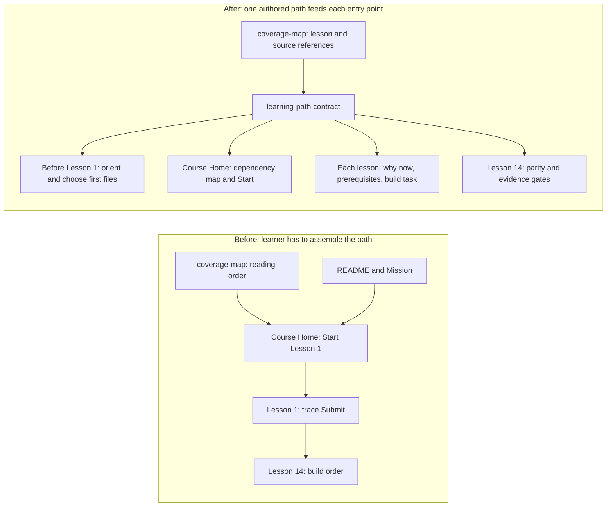

# Proposal: Give Code Arena learners a build path before Lesson 1

**Status:** Proposal for review, not implemented.
**Date:** 2026-09-27.
**Coverage:** Ranked 46 tracked `.tours/learning/` files by churn across eight course commits; read the top ten and inspected entry, generation, and source-reference areas, plus selected Game and frontend files. The 14 generated lesson pages were size-checked and sampled; they were not all read line by line. Existing working-tree edits were preserved.

## Ranked result

| Rank        | Candidate                                                                 | Pattern       | Strength   | Blast radius                                                                                                                                                                      | Deletion test                                                                                                                                                                                                                                         | Interface as test surface                                                                                                                                                                    |
| ----------- | ------------------------------------------------------------------------- | ------------- | ---------- | --------------------------------------------------------------------------------------------------------------------------------------------------------------------------------- | ----------------------------------------------------------------------------------------------------------------------------------------------------------------------------------------------------------------------------------------------------- | -------------------------------------------------------------------------------------------------------------------------------------------------------------------------------------------- |
| 1 — crowned | Put the learner's starting and build path in one authored course contract | Poor locality | **strong** | `coverage-map.json`, `scripts/build-catalog.mjs`, the Course Home and Lesson 1/14 templates, their generated pages, course guide, styling, and course tests; exact proposal below | **Pass.** Remove the rebuild sequence from Lesson 14 as the only source of construction order and let one path contract supply Course Home, orientation, and per-lesson build guidance; this concentrates the order where course navigation is owned. | **Pass.** Generate the public pages and check their links, prerequisites, dependency order, and file guidance through the course command and browser, without inspecting renderer internals. |

The entry, generator, and source-explorer surveys found no other shallow-interface, adapter-prevalence, or untested-coupling candidate that passed both gates. The generator and reference audit do substantial work, and removing either would only move that work to callers.

## Why this is the first move

Course Home currently selects the first numbered lesson as the Start link (`scripts/build-catalog.mjs:1057-1075`). The first batch puts Submit first, while Lobby, Problem/Run, and local project operation are Lessons 4, 5, and 13 (`coverage-map.json:45-100,190-239,508-565`). Lesson 1 immediately crosses the editor, transport, controller, Game service, Match engine, evaluation orchestrator, and Judge (`templates/0001-submit-journey.template.html:42-111`). Its rewrite prompt assumes a valid player, active Round, and fake Judge, but gives no target-repository starting point or file-placement decision (`templates/0001-submit-journey.template.html:136-148`). The construction sequence appears in Lesson 14 (`templates/0014-rewrite-with-tests.template.html:140-155`). This explains the learner's feeling that work must happen before Lesson 1.

There are two useful orders. **Trace order** follows an existing player action to understand this repository. **Build order** creates the prerequisites needed to code the same behavior independently. The current course publishes trace order but leaves build order until the end. Churn reinforces the locality problem: `coverage-map.json` changed six times, the generator four times, and the Lesson 14 template three times in the eight-course-commit history. Course-path changes have crossed metadata, authored pages, generated navigation, and tests. Regenerated HTML naturally changes with its template; the proposal addresses the authored path decision, not generated-file churn itself.

## Proposed shape

Add `.tours/learning/learning-path.json` as the authored contract for the **build** path. Keep `coverage-map.json` as the existing contract for lesson order, batches, and source references. Give each build step a stable ID, a plain-English reason, prerequisite step IDs, linked lesson IDs, a small observable result, and a file-placement brief. Validate that IDs are unique, prerequisites form no cycles, and every linked lesson exists. The contract must name _responsibilities_ first; paths from this repository are examples, not instructions to paste its architecture into a teammate's repository.

Generate a `Before Lesson 1` page and a dependency map on Course Home. Make that page the default Start destination for a new learner. It should ask the learner to find the teammate repository's package/workspace layout, game rules home, tests, frontend, backend route, persistence, and run commands, then record a chosen location for each responsibility. It should explain Match, Round, Problem, Run, Submission, Reveal, and Judge in easy English with a tiny playable scenario. It should end with one action: make a failing test for a Match with an active Round and a fixed clock. This orientation is a learning tool, not evidence that the game or a 42 subject module is complete.

Keep the 14 existing trace lessons. Render a short build card on each relevant lesson: **Why now? What must exist first? What do I create in my teammate's repo? What test shows it works? What source can I inspect for behavior?** Lesson 1 can still teach the full Submit trace, while clearly saying the learner should first build the smaller prerequisites. Replace Lesson 14's standalone build-order list with the same path and retain its valuable explanation of test evidence and parity.

### Dependency map to teach

| Step                               | Why it comes now                                                                            | Small deliverable in the teammate repository                                                                                          | Reference in this course                                                                    |
| ---------------------------------- | ------------------------------------------------------------------------------------------- | ------------------------------------------------------------------------------------------------------------------------------------- | ------------------------------------------------------------------------------------------- |
| 0. Find the homes                  | File paths depend on the teammate repository's structure.                                   | Record the existing game package, test folder, app, service, storage, and run commands; choose where each new responsibility belongs. | Before Lesson 1; Lesson 13 for reference-runtime differences.                               |
| 1. Make a small Match core         | Submit cannot be legal until a Match, Round, actor, phase, and clock exist.                 | Match/Round types, phase transitions, scoring rules, fixed-clock and fake-Judge test helpers; one failing then passing rule test.     | Lessons 3, 1, and 14; `packages/arena-game/src/round-lifecycle.ts` is a behavior reference. |
| 2. Make a valid player and Problem | A player needs membership and starter code before Run or Submit has meaning.                | Minimal Match creation/admission, one checked Problem, and a visible-example Run contract. A full Lobby UI can come later.            | Lessons 4 and 5.                                                                            |
| 3. Add Submit and Reveal           | The core can now decide who may submit and when; judging must not decide Match rules.       | Submit command, pending receipt, fake-Judge result, score and Reveal tests; then retry identity and deadline cases.                   | Lessons 1, 2, 6, and 7.                                                                     |
| 4. Make accepted state durable     | Reconnect and restart need a saved authoritative Match, Submission, and Reveal.             | Persistence interface and in-memory contract first; database adapter and restart/concurrency checks next.                             | Lesson 8; `MatchPersistence` and ADR-0004.                                                  |
| 5. Connect players to the core     | UI must send commands and render server-owned state once the rules are stable.              | Service route, transport contract, basic Arena view, reconnect snapshot test, then live browser check.                                | Lessons 9 and 12; ADR-0005.                                                                 |
| 6. Add team play                   | Shared edits and Ready approval rely on a working Match, durable state, and live transport. | 2v2 membership, shared document revisions, readiness reset, team-only chat and isolation checks.                                      | Lessons 10 and 11.                                                                          |
| 7. Verify the real boundaries      | Fakes cannot prove database, Docker, or browser behavior.                                   | Run equivalent tests in the teammate repository against PostgreSQL, Judge isolation, and two live clients; record skips separately.   | Lessons 7, 13, and 14.                                                                      |

The table is a proposed teaching order, not a claim that any step has been built in the teammate repository. It deliberately starts with a tiny domain rule and a test because the existing Submit path needs those states before a click can succeed. A learner may inspect Lesson 1 first for motivation, then return to Step 0 before coding.

### File-placement guidance each build card should give

Show a concrete **example** and an adaptation rule. For a teammate repo with this project's layout, Match and Round rules might go under `packages/arena-game/src/`, their tests under `packages/arena-game/test/`, a route under `services/game/src/game/`, and Arena rendering under `frontend/src/arena/` or `frontend/src/components/`. Before creating any directory, inspect whether the teammate repo already has those responsibilities elsewhere. Keep a rule test beside the game package, a route test beside the service, and a browser test in the frontend's existing end-to-end test location. Never make a duplicate game engine just because this reference has a folder with that name.

Each card should state the _behavior to reproduce_ using inputs and visible outputs, then link to the reference file and a test that currently exercises it. Ask the learner to write the behavior in their own words, write a failing test in the teammate repo, implement a small slice, and compare outcomes. Do not supply copy-ready implementation code from the reference. A passing reference test, a self-check click, and an unrun teammate test must stay visibly distinct.

## Blast radius and review checks

Expected authored files: new `learning-path.json` and `templates/0000-before-lesson-one.template.html`; existing `coverage-map.json`, `scripts/build-catalog.mjs`, `templates/course-home.template.html`, `templates/0001-submit-journey.template.html`, `templates/0014-rewrite-with-tests.template.html`, `assets/course.css`, `assets/course-activity.mjs` if orientation participates in resume, and `README.md`. Expected generated files: `index.html`, `lessons/0000-before-lesson-one.html`, and affected lesson pages. Expected tests: `scripts/build-catalog.test.mjs` and `scripts/course-experience.test.mjs`. Review source inventory and snapshot handling under `MAINTAINING.md`; do not refresh a reviewed snapshot just to make a check green.

Test through the public output: an untouched learner starts at orientation; a returning learner gets a useful resume link; every build step exposes its reason, prerequisites, target-repo responsibility, test, and lesson links; links work from local `file://` and the served course; a broken prerequisite cycle or missing lesson fails the course check; the page works with keyboard, 320-pixel viewport, denied storage, and no browser console errors. Run the root UI lint required by `AGENTS.md` when the UI is implemented. Keep activity labels as activity, never mastery or module completion.

This proposal changes no 42 subject scope, module claim, or implementation evidence. Before implementing it, check the relevant mandatory frontend, Chrome, console, and multi-user requirements and the gaming/remote-player requirements in `ft_transcendence.pdf` against `prototype/game-ui/42-subject-compliance.md`. The course must describe those requirements accurately without turning lessons or local checks into proof of compliance. The current course plan (`docs/superpowers/plans/2026-09-27-learning-course-refresh-and-experience.md`) says to keep the 14-lesson order; this proposal keeps those lessons and adds orientation and a separate build order, so it does not reverse an accepted ADR.

## Next review

Interrogate the assumptions, failure paths, and file blast radius of this proposal with the learner and a teammate before building it. Confirm the teammate repository's actual folders and test commands, then replace example paths with its real paths in the learner's Step 0 worksheet. Build the crowned change after the shape is agreed. No runner-up refactor is proposed.
